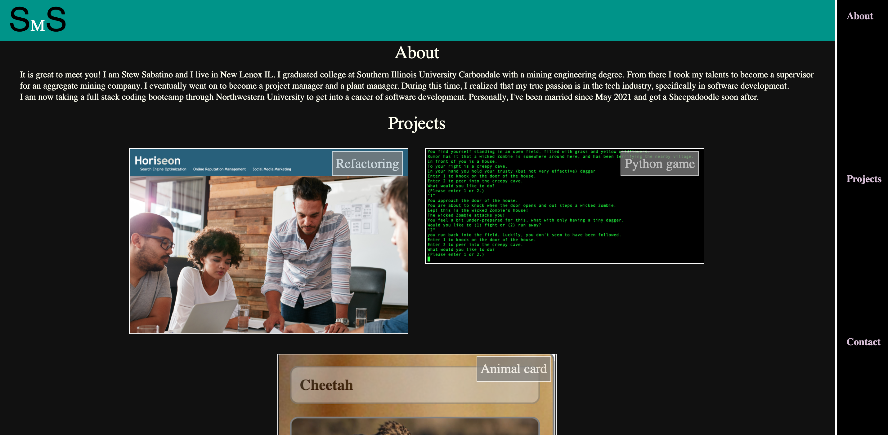

# stewsabatino.github.io
Personal Portfolio of Stew Sabatino

* Website URL - https://stewsabatino.github.io/
* 


# Goals
* Wireframe webpage on google slides
* Make a skeleton HTML with the information I want
* Make a clear title to be able to find website on search engine
* Make title clear for tab 
* Have header, nav bar, about me section, projects section with cards, contact section
* Use CSS to reset style and to style page, make cards and have hover actions

## HTML from Scratch
```
    <!DOCTYPE html>
    <html lang="en">

    <head>
        <meta charset="UTF-8">
        <meta http-equiv="X-UA-Compatible" content="IE=edge">
        <meta name="viewport" content="width=device-width, initial-scale=1.0">
        <title>Stew Sabatino - Portfolio</title>
        <link rel="stylesheet" href="./reset.css" />
        <link rel="stylesheet" href="./style.css" />
    </head>
    <body>
```
### styling header and nav
* Header styling
```
    header{
        background-color: rgb(0, 148, 136);

    }

    header h1 {
        display: inline;
        font-family: sans-serif;
        font-size: 367%;
        padding:20px;
    }

    header h1 .M {
        font-family: serif;
        font-size: 50%;
        color: white;
    }
```
* Navbar styling
```
    nav{
        display: grid;
        justify-content: space-around;
        top: 0;
        height: 100vh;
        width: 100px;
        position: fixed;
        z-index: 1;
        right: 0;
        background-color: black;
        border-left: solid white;
    }

    nav a {
        padding-top: 20px;
        color:thistle;
        font-size: 18px;
        text-decoration: none;
        font-weight: 600;
    }

    nav a:hover {
        color: #fff
    }
```
* Header is placed on the top of the page
* Navbar is set to the side of the page but will stay to 100% of the screen as you scroll up or down
* Hover was added to the nav bar to show that the contents are clickable

#### Project cards
* HTML code for project cards 
```
    <article class="projects" id="projects">
                    <h2>Projects</h2>
                    <section class="card">
                        <a href="https://github.com/stewsabatino/seo-code-refractor">
                            
                            <footer>Refactoring</footer>
                        </a>
                    </section>
```
* id was placed in article for when you click projects on the navbar you are linked to the projects part of the page
* the cards a clickable and send you to the project page
* the cards are styled in css for hover and flex
```
    .card {
        width: 500px;
        height: auto;
        position: relative;
        color: white;
        margin: 15px;
    }

    .card footer {
        position: absolute;
        font-size: x-large;
        font-family: serif;
        padding: 5px;
        background-color: grey;
        opacity: 75%;
        border: solid white 2px;
        top: 5px;
        right: 10px;
        color: white;
    }

    .card img {
        width: 100%;
        height: auto;
        border: solid white 2px;
    }
```
##### Hover actions
* hover is used to show something is clickable
```
    .card:hover img {
    border: solid aqua 5px;
    opacity: 50%;
    cursor: pointer;
    }
    .card:hover footer {
    opacity: 50%;
    border-color: aqua;
    cursor: pointer;
    color: aqua;
    }
```